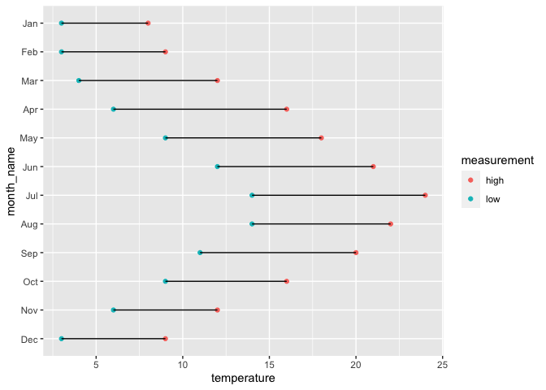

Dumbbell Plots
================

## Tweets

### Intro

How to create dumbbell plots with ggplot2

Impress clients, communicate complex insights simply and up your data
vis game. 

### \#1

Dumbbell plots are a great way of communicating information that can be
grouped then split into two points. 

I used one for last weeks
[TidyTuesday](https://github.com/neilcuz/tidytuesday/blob/master/scripts/tidy-tuesday_2022-07-12_flights.R)

But making them can be a little tricky. 

I can show you how step-by-step.

### \#2

Dumbbell plots can be created using 2 ggplot2 building blocks:
geom_point and geom_line.

So let’s start building from the ground up with some examples in each
before combining to make a dumbbell plot.

### \#3

1\. geom_point

Plots in ggplot2 start with the ggplot function. We then add +
successive layers with geometry functions before customising the
appearance further.

geom_point is used to create scatter plots and other point charts.

``` r
library(ggplot2)
library(dplyr)
library(tidyr)
library(lubridate)
```

``` r
# Create dummy data
set.seed(1001) # so random numbers can be replicated
dummy <- tibble(time_period = 1:100,
                value1 = runif(100, 0, 1), 
                value2 = runif(100, 0, 1),
                group1 = sample(c("a", "b", "c"), size = 100, replace = TRUE))

print(dummy)
```

    # A tibble: 100 × 4
       time_period  value1 value2 group1
             <int>   <dbl>  <dbl> <chr> 
     1           1 0.986   0.156  b     
     2           2 0.413   0.386  b     
     3           3 0.430   0.0356 b     
     4           4 0.419   0.686  c     
     5           5 0.427   0.0526 c     
     6           6 0.888   0.535  c     
     7           7 0.00610 0.819  a     
     8           8 0.0812  0.0439 c     
     9           9 0.289   0.603  c     
    10          10 0.765   0.818  b     
    # … with 90 more rows

``` r
# Some plots using geom_point

ggplot(data = dummy) + 
  geom_point(aes(x = value1, y = value2))
```


``` r
ggplot(data = dummy) +
  geom_point(aes(x = time_period, y = value1))
```


``` r
ggplot(data = dummy) +
  geom_point(aes(x = group1, y = value1))
```


### \#4

Notice I placed the x and y variables inside the aes function.

I found aesthetics a little hard to understand when learning - you read
lots of talk of mapping variables and visual cues which screams jargon
to me.

But I think there is an easier way to understand them.

### \#5

Anything on a chart (a line, point, colour, shape, size etc) which
changes with the data, place inside aes(). 

Anything which doesn’t vary with data (a colour, shape, size, etc),
place outside aes(). 

It’s easier to see with an example.

### \#6

In plot 1 colour is placed inside aes so the colour varies with the
data. Here it corresponds to the group1 value since colour = group1.

In the second plot colour is placed outside aes. The colour is red
regardless of the data values.

``` r
# Colour inside aes - it varies with the data
# Colour depends on the value of group1

ggplot(data = dummy) + 
  geom_point(aes(x = value1, y = value2, colour = group1))
```


``` r
# Colour outside aes - it does not vary with the data
# Colour will always be red here

ggplot(data = dummy) + 
  geom_point(aes(x = value1, y = value2), colour = "red")
```


### \#7

2\. geom_line

geom_line works similarly to geom_point.

You can add 1 or more lines and easily combine with geom_point.

``` r
# Some more dummy data
celsius <- tibble(date = as.Date(paste0("2020-", 1:12, "-01")),
                  high = c(8, 9, 12, 16, 18, 21, 24, 22, 20, 16, 12, 9),
                  low = c(3, 3, 4, 6, 9, 12, 14, 14, 11, 9, 6, 3)) |> 
  mutate(month_name = month(date, label = TRUE))

# Simple line chart

ggplot(data = celsius) +
  geom_line(aes(x = date, y = high))
```


``` r
# Multiple lines

ggplot(data = celsius) +
  geom_line(aes(x = date, y = high), colour = "red") +
  geom_line(aes(x = date, y = low), colour = "blue") +
  labs(y = "Temperature")
```


``` r
# Lines and points

ggplot(data = celsius) +
  geom_line(aes(x = date, y = high), colour = "red") +
  geom_line(aes(x = date, y = low), colour = "blue") +
  geom_point(aes(x = date, y = high), colour = "red", size = 2) +
  geom_point(aes(x = date, y = low), colour = "blue", size = 2) +
  labs(y = "Temperature")
```


### \#8

The dummy celsius dataset was in what is known as wide format. 

We can put this into long format using pivot_longer from tidyr. Long
format will be important for our dumbbell plot. There is now a row for
high and for low for each month.

``` r
celsius_long <- pivot_longer(celsius, 
                             cols = c(high, low), 
                             names_to = "measurement",
                             values_to = "temperature")

print(celsius)
```

    # A tibble: 12 × 4
       date        high   low month_name
       <date>     <dbl> <dbl> <ord>     
     1 2020-01-01     8     3 Jan       
     2 2020-02-01     9     3 Feb       
     3 2020-03-01    12     4 Mar       
     4 2020-04-01    16     6 Apr       
     5 2020-05-01    18     9 May       
     6 2020-06-01    21    12 Jun       
     7 2020-07-01    24    14 Jul       
     8 2020-08-01    22    14 Aug       
     9 2020-09-01    20    11 Sep       
    10 2020-10-01    16     9 Oct       
    11 2020-11-01    12     6 Nov       
    12 2020-12-01     9     3 Dec       

``` r
print(celsius_long)
```

    # A tibble: 24 × 4
       date       month_name measurement temperature
       <date>     <ord>      <chr>             <dbl>
     1 2020-01-01 Jan        high                  8
     2 2020-01-01 Jan        low                   3
     3 2020-02-01 Feb        high                  9
     4 2020-02-01 Feb        low                   3
     5 2020-03-01 Mar        high                 12
     6 2020-03-01 Mar        low                   4
     7 2020-04-01 Apr        high                 16
     8 2020-04-01 Apr        low                   6
     9 2020-05-01 May        high                 18
    10 2020-05-01 May        low                   9
    # … with 14 more rows

### \#9

From long format we can replicate the last plot with similar code.

Notice to get the correct colours I have created a named vector called
chart colours and passed it to scale_colour_manual.

This approach even throws in a legend.

Now we are ready for the dumbbell plot.

``` r
chart_colours <- c("high" = "red", "low" = "blue")

ggplot(data = celsius_long) +
  geom_line(aes(x = date, y = temperature, colour = measurement)) +
  geom_point(aes(x = date, y = temperature, colour = measurement), size = 2) +
  labs(y = "Temperature") +
  scale_colour_manual(values = chart_colours)
```


### \#10

3\. Dumbbell plots

We know about geom_point, geom_line, aes and long format. We can combine
these to make a dumbbell plot.

Let’s start with the points.

### \#11

We will group our data by high and low temperature with a point for the
value. The y axis will have the months.

The first stab at it is not bad but the months go from December to
January. 

We can sort this by reordering the month name factor level.

``` r
# First stab at the points

ggplot(data = celsius_long) +
  geom_point(aes(x = temperature, y = month_name, colour = measurement)) 
```


``` r
# Fix the order of the months so it goes jan -> dec

reverse_months <- celsius_long |> 
  pull(month_name) |> 
  unique() |> 
  rev()
  
celsius_long <- mutate(celsius_long, 
                       month_name = factor(month_name, levels = reverse_months)) 

ggplot(data = celsius_long) +
  geom_point(aes(x = temperature, y = month_name, colour = measurement)) 
```


### \#12

Next we add the lines. 

Here we use the group argument and place it inside aes. This will group
the lines by month_name. The other aes arguments are the same.

The first attempt is ok but the lines overlap the points. Not to worry,
we can swap them.

``` r
# Add the lines

ggplot(data = celsius_long) +
  geom_point(aes(x = temperature, y = month_name, colour = measurement)) +
  geom_line(aes(x = temperature, y = month_name, group = month_name))
```



``` r
# Reorder so the points are on top of the line

ggplot(data = celsius_long) +
  geom_line(aes(x = temperature, y = month_name, group = month_name)) +
  geom_point(aes(x = temperature, y = month_name, colour = measurement))
```


### \#13

Finally we can make some tweaks to make the chart look better. We could
do plenty more but the objective here was to learn about dumbbell plot,
not the ins and outs of good design.

``` r
# Some tweaks to make it look nicer

ggplot(data = celsius_long) +
  geom_line(aes(x = temperature, y = month_name, group = month_name)) +
  geom_point(aes(x = temperature, y = month_name, colour = measurement), size = 4) +
  scale_color_manual(values = chart_colours) +
  theme_minimal() +
  labs(x = "Temperature", 
       y = "", 
       title = "Dumbbell plot of dummy temperatures")
```


### \#14

TL;DR

1\. Dumbbell plots are a great way to communicate insights. 

2\. These can be created with ggplot2 by combining geom_line and
geom_point.

3\. You need to know a bit about aesthetics and long format data.

### \#15

Thanks for reading, if you liked this thread follow me
[@neilgcurrie](https://twitter.com/neilgcurrie) for mainly R and data
science stuff (though I make no promises).

See the [README file](https://github.com/neilcuz/threads) to get the
code for this thread and others.
