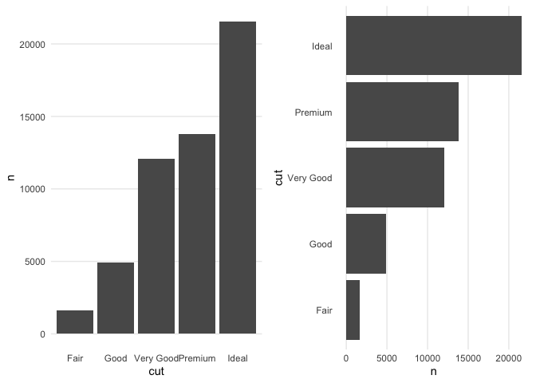
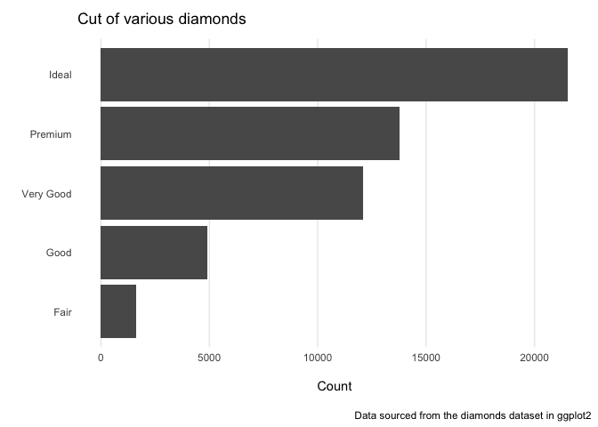
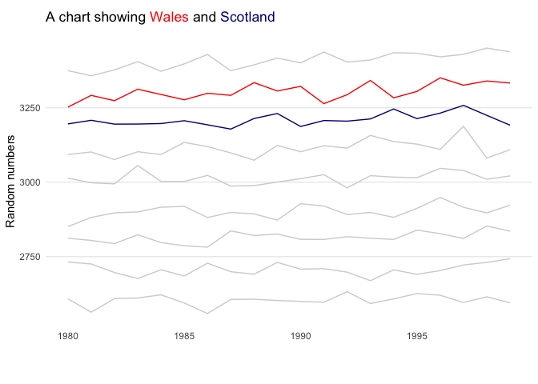
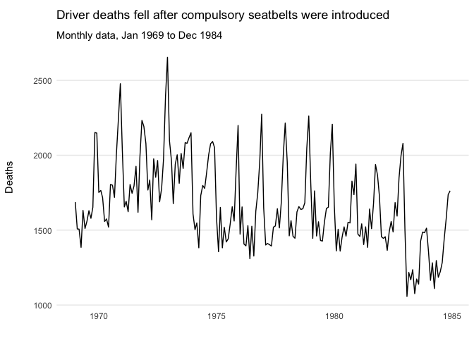
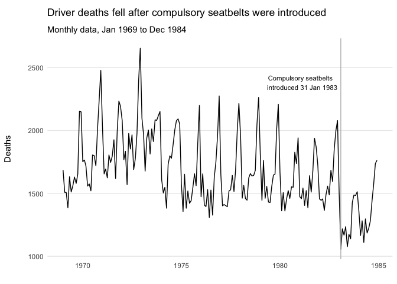
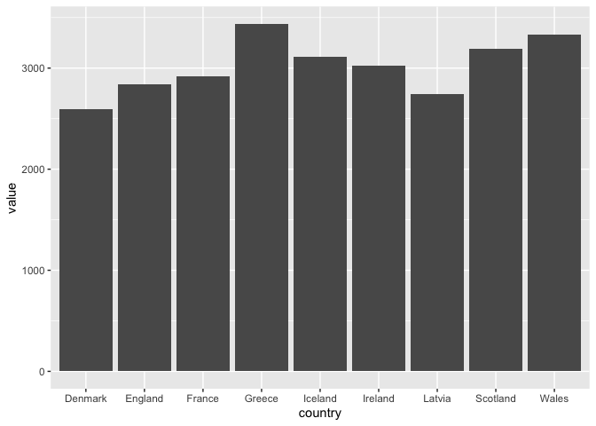
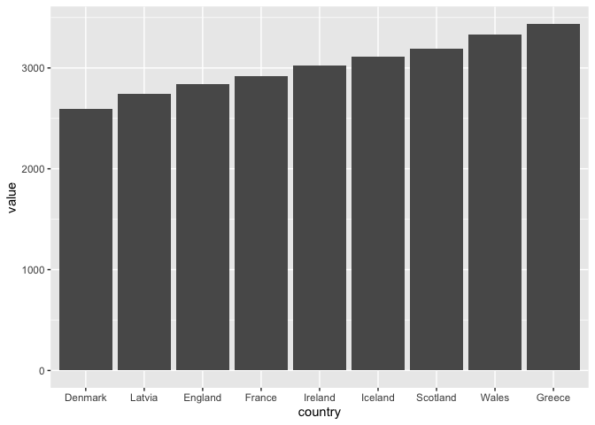
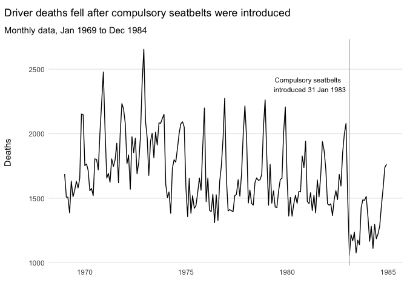

Data Vis Tips with ggplot2
================

## Tweets

### Intro

Want to have impact with your analysis? 

Then you need to tell a compelling story with your data.

Data vis is key to this.

8 tips for better data vis (a thread using the best data vis package
around, ggplot2).

### \#1

Communicating analysis is an essential skill for any data scientist or
analyst. 

There is no point building a fancy model if your customer doesn’t
understand the outcome.

It’s your job to help them understand - and data vis is crucial. 

Here are 8, opinionated, tips.

### \#2

1\. Use the right chart

The first thing I think about is what message do I want to communicate.
Chart choice flows from here.

This will inform what type of data you want to show and how you want to
show it.

There isn’t always a ‘right’ answer.

### \#3

Which chart do do you think is best here if the message I want to get
across is that ideal has the largest count? 

All of them communicate that but personally I like the standard bar.

``` r
library(ggplot2)
library(dplyr)
library(gridExtra)
library(readr)
library(tidyr)
library(lubridate)
library(ggtext)
library(glue)
```

``` r
chart_data <- diamonds |> count(cut) |> mutate(row_num = 1:n())
  
p <- ggplot(chart_data, aes(cut, n))

p_point <- p + geom_point()
p_bar <- p + geom_bar(stat = "identity")
p_stack <- p + geom_bar(aes(x = "", fill = cut), stat = "identity")
p_pie <- p_stack + coord_polar("y")

grid.arrange(p_bar, p_point, p_stack, p_pie)
```


### \#4

2\. Keep things simple

A good rule of thumb is drop anything you don’t need. The classic
ggplot2 theme is a bit busy for me but I like theme minimal.

You can also drop grid lines - in this case we certainly don’t need the
vertical lines and the horizontals are arguable.

``` r
p_bar_minimal <- p_bar + 
  theme_minimal() +
  theme(panel.grid.major.x = element_blank(),
        panel.grid.minor = element_blank())

grid.arrange(p_bar, p_bar_minimal, nrow = 1)
```


### \#5

3\. Give things room to breathe

The first obvious thing is the x-axis labels are falling over each
other.

You could:

1\. Reduce the font size or text length.

2\. Rotate the labels.

3\. Switch the axis.

I like 3.

``` r
p_bar_rotate <- p_bar_minimal + 
  coord_flip() +
  # Need to change the gridlines from before since we rotated
  theme(panel.grid.major.y = element_blank(),
        panel.grid.major.x = element_line())

grid.arrange(p_bar_minimal, p_bar_rotate, nrow = 1)
```



### \#6

At this point let’s title the chart and axis properly - give those
labels a bit of room too with the margin command.

``` r
p_bar_titled <- p_bar_rotate +
  
  # Note x and y flipped so the following seems back to front
  
  labs(title = "Cut of various diamonds", 
       x = "", 
       y = "Count", 
       caption = "Data sourced from the diamonds dataset in ggplot2") +
  theme(plot.title = element_text(margin = margin(t = 5, b = 10)),
        axis.title.x = element_text(margin = margin(t = 15, b = 10)))
  
p_bar_titled
```



### \#7

4\. Use colours effectively

Colours are a great way of making things look good, distinguishing data
points and drawing attention to the things that matter.

But use them sparingly for maxium effect.

``` r
# Create some dummy data with a trend

make_fake_trend <- function (beta1) {
  
  x <- 1980:1999
  y <- 25 + beta1 * x + rnorm(length(x), sd = 20)
  
}

countries <- c("Greece", "Wales", "Scotland", "Iceland", "Ireland", "France", "England", 
               "Latvia", "Denmark")

fake <- tibble(year = 1980:1999)
beta1 <- 1.7 # Initialise

for (country in countries) {
  
  fake[,country] <- make_fake_trend(beta1)
  beta1 <- beta1 - 0.05
  
}

print(fake)
```

    # A tibble: 20 × 10
        year Greece Wales Scotland Iceland Ireland France England Latvia Denmark
       <int>  <dbl> <dbl>    <dbl>   <dbl>   <dbl>  <dbl>   <dbl>  <dbl>   <dbl>
     1  1980  3375. 3252.    3195.   3093.   3014.  2851.   2812.  2732.   2608.
     2  1981  3357. 3291.    3208.   3101.   2998.  2882.   2804.  2725.   2563.
     3  1982  3377. 3274.    3195.   3076.   2994.  2897.   2794.  2697.   2609.
     4  1983  3405. 3312.    3195.   3102.   3056.  2900.   2823.  2676.   2611.
     5  1984  3372. 3294.    3197.   3093.   3002.  2916.   2797.  2706.   2622.
     6  1985  3397. 3277.    3206.   3134.   3002.  2919.   2786.  2685.   2594.
     7  1986  3429. 3298.    3192.   3119.   3023.  2881.   2782.  2728.   2559.
     8  1987  3374. 3291.    3178.   3098.   2987.  2898.   2836.  2699.   2606.
     9  1988  3394. 3334.    3214.   3074.   2988.  2893.   2821.  2691.   2607.
    10  1989  3416. 3306.    3230.   3123.   3000.  2872.   2826.  2731.   2603.
    11  1990  3400. 3322.    3187.   3102.   3012.  2928.   2808.  2708.   2600.
    12  1991  3437. 3263.    3207.   3122.   3025.  2920.   2808.  2710.   2597.
    13  1992  3403. 3294.    3205.   3114.   2981.  2891.   2817.  2698.   2632.
    14  1993  3410. 3341.    3212.   3157.   3022.  2898.   2812.  2669.   2592.
    15  1994  3434. 3283.    3246.   3136.   3017.  2882.   2808.  2706.   2608.
    16  1995  3433. 3305.    3213.   3128.   3015.  2912.   2839.  2691.   2626.
    17  1996  3421. 3350.    3232.   3110.   3046.  2949.   2827.  2703.   2620.
    18  1997  3429. 3325.    3258.   3187.   3039.  2916.   2811.  2722.   2596.
    19  1998  3450. 3340.    3224.   3081.   3009.  2897.   2853.  2730.   2615.
    20  1999  3438. 3333.    3191.   3109.   3021.  2922.   2835.  2743.   2595.

``` r
highlight_countries <- c("Scotland", "Wales")

fake <- pivot_longer(fake, cols = -year, names_to = "country") |> 
  mutate(country_other = if_else(country %in% highlight_countries, country, "Other"))


chart_colours <- rep("#D3D3D3", length(countries))
names(chart_colours) <- countries

chart_colours["Scotland"] <- "darkblue"
chart_colours["Wales"] <- "red"
names(chart_colours)[!(names(chart_colours) %in% highlight_countries)] <- "Other"

# Too many colours plot

pmess <- fake |> 
  ggplot(aes(x = year, y = value, colour = country, group = country)) +
  geom_line() +
  labs(title = "Too many colours",
       x = "",
       y = "Random numbers") +
  theme_minimal() +
    theme(plot.title = element_text(margin = margin(t = 5, b = 10)),
          axis.title.x = element_text(margin = margin(t = 15, b = 10)),
          panel.grid.major.x = element_blank(),
          panel.grid.minor = element_blank(),
          legend.position = "none") 

# A better plot

pnice <- fake |> 
  ggplot(aes(x = year, y = value, colour = country_other, group = country)) +
  geom_line() +
  labs(title = "Important lines highlighted",
       x = "",
       y = "Random numbers") +
  theme_minimal() +
    theme(plot.title = element_text(margin = margin(t = 5, b = 10)),
          axis.title.x = element_text(margin = margin(t = 15, b = 10)),
          panel.grid.major.x = element_blank(),
          panel.grid.minor = element_blank(),
          legend.position = "none") +
  scale_colour_manual(values = chart_colours)

grid.arrange(pmess, pnice, nrow = 1)
```


### \#8

WIth colours it’s important to consider accessibility. Colour blindness
is common - it affects around 4.5% of the UK population, particularly
men. I would guess it’s similar elsewhere.

This is a great resource for checking your palettes:

[Coloring for
Colorblindness](https://davidmathlogic.com/colorblind/#%23D81B60-%231E88E5-%23FFC107-%23004D40-%23edd7d)

### \#9

And don’t use pink for women and blue for men. It’s a lazy stereotype.

### \#10

6\. Drop the legend

Legends help interpret a chart but can sometimes confuse users.

Two great alternatives:

\- Label data series directly (with the secondary axis trick)

\- Use colour in your titles or subtitles with html and the ggtext
package

``` r
# Label directly
latest_points <- fake |> 
  filter(country_other != "Other") |> 
  arrange(desc(year)) |> 
  slice(1:2)

pnice +
  scale_y_continuous(
    sec.axis = dup_axis(
      breaks = latest_points$value,
      labels = latest_points$country,
      name = NULL
    )
  ) +
  labs(title = "A chart labelled directly")
```


``` r
# Colouring the title

# Use html to set the colours
title_html <- glue(
  "A chart showing <span style='color:{chart_colours['Wales']};'>Wales</span> 
  and <span style='color:{chart_colours['Scotland']};'>Scotland</span>"
  )

pnice +
  labs(title = title_html) +
  theme(plot.title = element_markdown())
```



### \#11

5\. Clarify with text

Think very carefully about titles, subtitles and labels. 

You have 2 aims: make the chart interpretable and communicate your key
messages. 

I like to tell the viewer what the main message is in the title or
subtitle.

``` r
# Format the data
uk_driver_deaths <- tibble(year = rep(1969:1984, each = 12),
                           month = rep(1:12, length(1969:1984)),
                           date = paste0(year, "-", month, "-01"),
                           deaths = as.vector(UKDriverDeaths)) |> 
  mutate(date = ymd(date)) # date class great for ggplot plots

# Plot
p_drivers <- ggplot(uk_driver_deaths, aes(x = date, y = deaths)) +
  geom_line() +
  labs(title = "Driver deaths fell after compulsory seatbelts were introduced",
       subtitle = "Monthly data, Jan 1969 to Dec 1984",
       x = "",
       y = "Deaths") +
  theme_minimal() +
    theme(plot.title = element_text(margin = margin(t = 5, b = 10)),
          axis.title.y = element_text(margin = margin(r = 20)),
          panel.grid.major.x = element_blank(),
          panel.grid.minor = element_blank(),
          legend.position = "none") 

p_drivers
```



### \#12

Annotations are another great way to tell your story. 

You can give the viewer key data and highlight interesting points. Same
rules apply though - use them sparingly to maximise effect.

``` r
p_drivers_annotated <- p_drivers +
  geom_vline(xintercept = as.Date("1983-01-31"), colour = "gray") +
  annotate("text", 
           x = as.Date("1981-01-30"), 
           y = 2380, 
           label = "Compulsory seatbelts \n introduced 31 Jan 1983",
           size = 3)

p_drivers_annotated
```



### \#13

7\. Order deliberately

For categorical data with an inherent order, use factors to make sure
they display correctly.

Another option is to order by size e.g. for bar charts.

``` r
tshirt_sales <- tibble(size = c("xs", "s", "m", "l", "xl"),
                       quantity = c(101, 345, 370, 359, 243))

# Default order
p_tshirt_no_order <- ggplot(tshirt_sales, aes(x = size, y = quantity)) +
  geom_bar(stat = "identity") +
  labs(title = "Default order - alphabetical")

tshirt_sales <- mutate(tshirt_sales, 
                        size = factor(size, levels = size))

# Proper order
p_tshirt_order <- ggplot(tshirt_sales, aes(x = size, y = quantity)) +
  geom_bar(stat = "identity") +
  labs(title = "Ordered correctly - factor")

grid.arrange(p_tshirt_no_order, p_tshirt_order)
```


``` r
# Default order
fake |> 
  filter(year == 1999) |> 
  ggplot(aes(x = country, y = value)) +
  geom_bar(stat = "identity")
```



``` r
# Order low to high
fake |> 
  filter(year == 1999) |> 
  arrange(value) |> 
  mutate(country = factor(country, levels = country)) |> 
  ggplot(aes(x = country, y = value)) +
  geom_bar(stat = "identity")
```



### \#14

8\. Align titles

The last and probably the easiest tip. Aligning the plot title against
the whole plot and labels not just the panel.

``` r
# Original plot
p_drivers_annotated 
```


``` r
# Align titles to the plot not panel for a better finish
p_drivers_annotated + theme(plot.title.position = "plot")
```



### \#15

Recap:

1\. Use the right chart

2\. Keep things simple

3\. Give things room to breathe

4\. Use colours effectively

5\. Drop the legend

6\. Clarify with text

7\. Order deliberately

8\. Align titles
