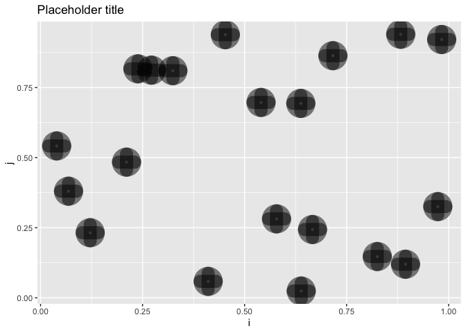

Writing Functions
================

This notebook contains the code underpinning the Writing Functions
thread.

Follow me on Twitter [@neilgcurrie](twitter.com/neilgcurrie) and visit
[torchdata.io](https://www.torchdata.io).

You can find links to all my threads
[here](https://github.com/neilcuz/threads).

## Setup

Install the packages if you need to.

``` r
install.packages("dplyr")
install.packages("ggplot2")
```

And load them.

``` r
library(dplyr)
library(ggplot2)
```

## When to write functions

The rule of three.

``` r
# Bad

sample1 <- sample(c(TRUE, FALSE), size = 10, replace = TRUE)
names(sample1) <- paste0("pos", 1:10)
sample1_true <- sample1[sample1 == TRUE]

sample2 <- sample(c(TRUE, FALSE), size = 15, replace = TRUE)
names(sample2) <- paste0("pos", 1:15)
sample2_true <- sample2[sample2 == TRUE]

sample3 <- sample(c(TRUE, FALSE), size = 20, replace = TRUE)
names(sample3) <- paste0("pos", 1:20)
sample3_true <- sample3[sample3 == TRUE]

# Better

sampler <- function (size) {
  
  my_sample <- sample(c(TRUE, FALSE), size, replace = TRUE)
  names(my_sample) <- paste0("pos", 1:size)

  return(my_sample[my_sample == TRUE])
  
}

sample1 <- sampler(10)
sample2 <- sampler(15)
sampler3 <- sampler(20)
```

## Defining functions

``` r
# If you cast your mind back to school this is Pythagoras' Theorem. 
# This function calculates side c (the hypotenuse) given sides a and b of a triangle

# The function name is calculate_c, side_a and side_b are arguments

calculate_c <- function (side_a, side_b) {
  
  return(sqrt(side_a ^ 2 + side_b ^ 2))
  
}

# We could extend the function and give the user control of if they want c
# squared or not. Here we have given squared a default value of FALSE.

calculate_c <- function (side_a, side_b, squared = FALSE) {
  
  side_c <- side_a ^ 2 + side_b ^ 2

  if (squared == TRUE) {
    
    return(side_c)
    
  } else {
    
    return(sqrt(side_c))
    
  }
}
```

## Tidy evaluation

This won’t work

``` r
dummy <- tibble(id = 1:20, i = runif(20), j = runif(20), k = runif(20))

transform_data1 <- function(x, min_value, filter_by, sort_by) {
  
  x |> 
    filter(filter_by >= min_value) |> 
    arrange(sort_by) 
  
}
```

``` r
transform_data1(dummy, 0.5, j, k) # error!
```

This will work. And an example of using :=

``` r
# Will work with the curly brackets

transform_data2 <- function(x, min_value, filter_by, sort_by) {
  
  x |> 
    filter({{filter_by}} >= min_value) |> 
    arrange({{sort_by}}) 
  
}

transform_data2(dummy, 0.5, j, k)
```

    # A tibble: 14 × 4
          id       i     j      k
       <int>   <dbl> <dbl>  <dbl>
     1     7 0.126   0.691 0.0170
     2     4 0.578   0.587 0.199 
     3    19 0.187   0.994 0.266 
     4     5 0.186   0.913 0.291 
     5    10 0.132   0.528 0.486 
     6     3 0.673   0.777 0.624 
     7    16 0.00179 0.946 0.625 
     8    13 0.854   0.768 0.637 
     9     6 0.0176  0.520 0.695 
    10     1 0.892   0.946 0.821 
    11     9 0.0483  0.654 0.872 
    12     8 0.00406 0.996 0.901 
    13    20 0.305   0.564 0.912 
    14    11 0.0732  0.833 0.957 

``` r
# Using := to modify the left hand side or name

transform_data3 <- function(x, min_value, filter_by, sort_by, new_name) {
  
  x |> 
    filter({{filter_by}} >= min_value) |> 
    arrange({{sort_by}}) |> 
    mutate({{new_name}} := {{filter_by}} * {{sort_by}})
    
  
}

transform_data3(dummy, 0.5, i, k, "l")
```

    # A tibble: 6 × 5
         id     i     j     k     l
      <int> <dbl> <dbl> <dbl> <dbl>
    1     4 0.578 0.587 0.199 0.115
    2    18 0.893 0.478 0.323 0.288
    3     3 0.673 0.777 0.624 0.420
    4    13 0.854 0.768 0.637 0.544
    5     1 0.892 0.946 0.821 0.733
    6    17 0.707 0.370 0.831 0.588

## Error handling for arguments

``` r
calculate_c <- function (side_a, side_b, squared = FALSE) {
  
  if (side_a <= 0) {
    
    stop ("side_a must be positive")
    
  }
  
  if (side_b <= 0) {
    
    stop ("side_b must be negative")
    
  }
  
  if (length(side_a) != length(side_b)) {
    
    stop ("side_a and side_by must have the same length")
    
  }
  
  if (!is.logical(squared)) {
    
    stop ("squared must be TRUE or FALSE")
    
  }
  
  side_c <- side_a ^ 2 + side_b ^ 2

  if (squared == TRUE) {
    
    return(side_c)
    
  } else {
    
    return(sqrt(side_c))
    
  }
}
```

## Using ellipsis

``` r
# Maybe you want to use some of the aesthetics for tweaking geom_point.
# Maybe you arent sure which ones, all you know is you will be doing a bunch
# of scatter plots of i and j.

ggplot(dummy, aes(x = i, y= j)) +
  geom_point(size = 5, shape = 14) +
  labs(title = "My nice plot")
```


``` r
plotter <- function (plot_data, ..., title = "Placeholder title") {
  
  ggplot(plot_data, aes(x = i, y = j)) +
    geom_point(...) +
    labs(title = title)
  
}

plotter(dummy, alpha = 0.5, shape = 10, stroke = 10)
```



## Functions written for their side effects

Let’s jut use the plotter function from the last example. Return the
first argument unmodified and invisibly.

``` r
plotter2 <- function (plot_data, ..., title = "Placeholder title") {
  
  ggplot(plot_data, aes(x = i, y = j)) +
    geom_point(...) +
    labs(title = title)
  
  return(invisible(plot_data))
  
}

p <- plotter2(dummy, size = 3, shape = 4, stroke = 5)

print(p)
```

    # A tibble: 20 × 4
          id       i     j      k
       <int>   <dbl> <dbl>  <dbl>
     1     1 0.892   0.946 0.821 
     2     2 0.0871  0.434 0.844 
     3     3 0.673   0.777 0.624 
     4     4 0.578   0.587 0.199 
     5     5 0.186   0.913 0.291 
     6     6 0.0176  0.520 0.695 
     7     7 0.126   0.691 0.0170
     8     8 0.00406 0.996 0.901 
     9     9 0.0483  0.654 0.872 
    10    10 0.132   0.528 0.486 
    11    11 0.0732  0.833 0.957 
    12    12 0.486   0.218 0.535 
    13    13 0.854   0.768 0.637 
    14    14 0.377   0.114 0.298 
    15    15 0.0505  0.229 0.110 
    16    16 0.00179 0.946 0.625 
    17    17 0.707   0.370 0.831 
    18    18 0.893   0.478 0.323 
    19    19 0.187   0.994 0.266 
    20    20 0.305   0.564 0.912 
