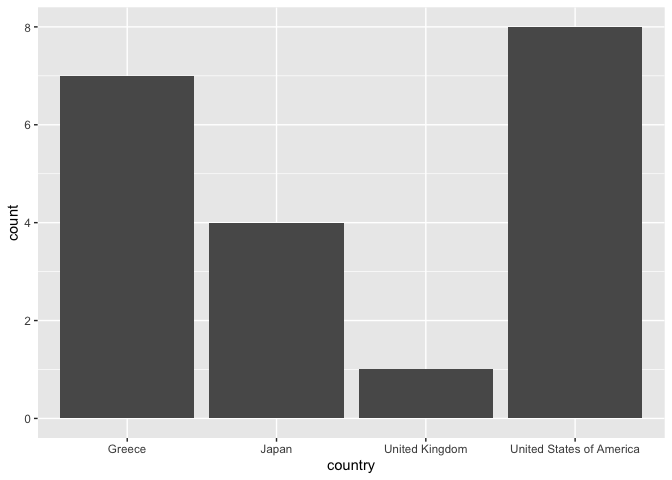
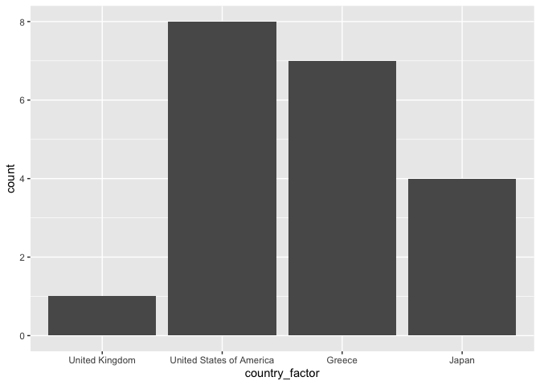
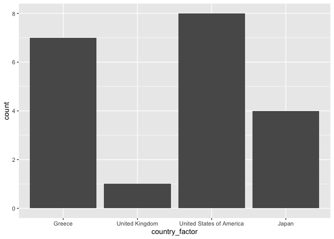
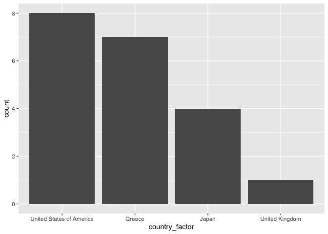
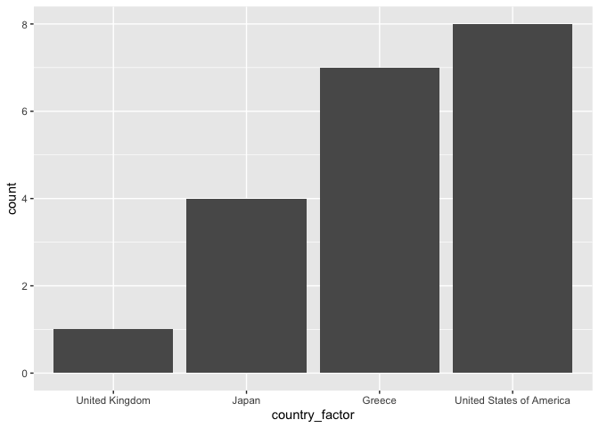
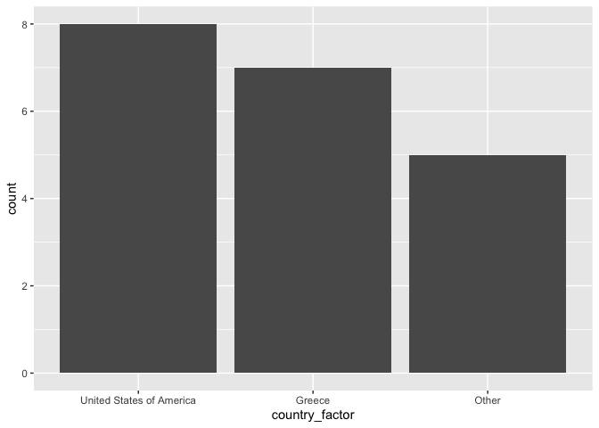
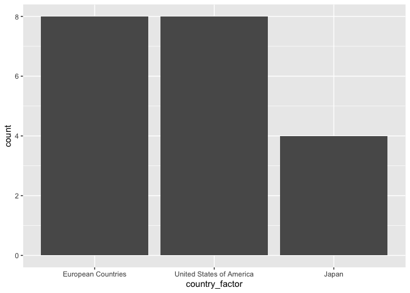

Mastering Factors in R
================

This notebook contains the code underpinning the *Factors* Twitter
thread.

- Want to learn Git and GitHub? Checkout my course [Git and GitHub for
  Beginners](https://www.shoogle.co/challenge-page/git-and-github-for-beginners)

- Subscribe to my YouTube channel for videos on R and data science
  @shoogle [youtube.com/@shoogle](www.youtube.com/@shoogle)

- Follow me on Twitter for weekly threads on data and coding
  @neilgcurrie [twitter.com/neilgcurrie](www.twitter.com/neilgcurrie)

You can find links to all my threads
[here](https://github.com/neilcuz/threads).

## Setup

First we need to load `forcasts`, `ggplot2` and `dplyr`. This piece of
code will check if the `pacman` package is installed and, if not, it
will download it from CRAN. Then it loads the required libraries,
downloading if need be.

``` r
if (!require(pacman)) install.packages("pacman")
pacman::p_load(forcats, ggplot2, dplyr)
```

Usually you will want to create a factor variable from a character
variable though it could be others like numeric.

To create a factor variable we use the `factor` function. Use the levels
argument to set the valid categories.

``` r
countries_valid <- c("United Kingdom", 
                     "United States of America", 
                     "Greece",
                     "Japan")

set.seed(100)
countries_sample <- sample(countries_valid, size = 20, replace = TRUE)

countries_factor <- factor(countries_sample, levels = countries_valid)

print(countries_factor)
```

     [1] United States of America Greece                   United States of America
     [4] Japan                    Greece                   United Kingdom          
     [7] United States of America United States of America Japan                   
    [10] Greece                   Japan                    United States of America
    [13] United States of America Japan                    Greece                  
    [16] United States of America United States of America Greece                  
    [19] Greece                   Greece                  
    Levels: United Kingdom United States of America Greece Japan

If any of the levels are not present in your character vector it will
show as NA.

``` r
countries_sample_invalid <- c(countries_sample, "California", "Dagestan", 
                              "Bavaria")

countries_factor_invalid <- factor(countries_sample_invalid, 
                                   levels = countries_valid)

print(countries_factor_invalid)
```

     [1] United States of America Greece                   United States of America
     [4] Japan                    Greece                   United Kingdom          
     [7] United States of America United States of America Japan                   
    [10] Greece                   Japan                    United States of America
    [13] United States of America Japan                    Greece                  
    [16] United States of America United States of America Greece                  
    [19] Greece                   Greece                   <NA>                    
    [22] <NA>                     <NA>                    
    Levels: United Kingdom United States of America Greece Japan

If you want to change the levels, maybe to shorten some of them like in
this example, use the labels argument.

``` r
countries_valid_short <- c("UK", "USA", "Greece", "Japan")

countries_factors_short <- factor(countries_sample, levels = countries_valid, 
                                  labels = countries_valid_short)
print(countries_factors_short)
```

     [1] USA    Greece USA    Japan  Greece UK     USA    USA    Japan  Greece
    [11] Japan  USA    USA    Japan  Greece USA    USA    Greece Greece Greece
    Levels: UK USA Greece Japan

A variable like countries has no inherent order though but some factors
do.

``` r
sizes <- c("small", "medium", "large")

sizes_sample <- sample(sizes, size = 10, replace = TRUE)

sizes_factor <- factor(sizes_sample, levels = sizes, ordered = TRUE)

print(sizes_factor)
```

     [1] large  medium small  large  large  medium small  medium large  medium
    Levels: small < medium < large

We can easily do this type of thing in a data.frame/tibble using dplyr.

``` r
countries_tbl <- tibble(country = countries_sample) |> 
  mutate(country_factor = factor(country, levels = countries_valid))

print(countries_tbl)
```

    # A tibble: 20 × 2
       country                  country_factor          
       <chr>                    <fct>                   
     1 United States of America United States of America
     2 Greece                   Greece                  
     3 United States of America United States of America
     4 Japan                    Japan                   
     5 Greece                   Greece                  
     6 United Kingdom           United Kingdom          
     7 United States of America United States of America
     8 United States of America United States of America
     9 Japan                    Japan                   
    10 Greece                   Greece                  
    11 Japan                    Japan                   
    12 United States of America United States of America
    13 United States of America United States of America
    14 Japan                    Japan                   
    15 Greece                   Greece                  
    16 United States of America United States of America
    17 United States of America United States of America
    18 Greece                   Greece                  
    19 Greece                   Greece                  
    20 Greece                   Greece                  

This let’s us control the order of categories on plots easily. If we
just use the character variable country the categories will be ordered
alphabetically.

``` r
countries_tbl |> 
  ggplot(aes(x = country)) +
  geom_bar()
```



If we use the factor the categories will be ordered in the same order we
specified the levels in.

``` r
countries_tbl |> 
  ggplot(aes(x = country_factor)) +
  geom_bar()
```



We can manually reorder by changing the levels.

``` r
new_levels <- c("Greece", "United Kingdom", "United States of America", "Japan")

countries_tbl |> 
  mutate(country_factor = factor(country, levels = new_levels)) |>   
  ggplot(aes(x = country_factor)) +
  geom_bar()
```



The forcats package has some great functions for manipulating factors.

If we want to order our factors by count we can use `fct_infreq`.
Plotting by count is often a good idea aesthetically.

``` r
countries_tbl |> 
  mutate(country_factor = fct_infreq(country_factor)) |>   
  ggplot(aes(x = country_factor)) +
  geom_bar()
```



Reversing the levels is easy too with `fct_rev`

``` r
countries_tbl |> 
  mutate(country_factor = fct_infreq(country_factor),
         country_factor = fct_rev(country_factor)) |>   
  ggplot(aes(x = country_factor)) +
  geom_bar()
```



We can lump factors with low counts together using fct_lump_min

``` r
countries_tbl |> 
  mutate(country_factor = fct_lump_min(country_factor, min = 5)) |>    
  ggplot(aes(x = country_factor)) +
  geom_bar()
```



We can combine factors manually into a new category.

``` r
countries_tbl |> 
  mutate(country_factor = fct_collapse(
    country_factor,
    `European Countries` = c("Greece", "United Kingdom")
    )) |>    
  ggplot(aes(x = country_factor)) +
  geom_bar()
```


