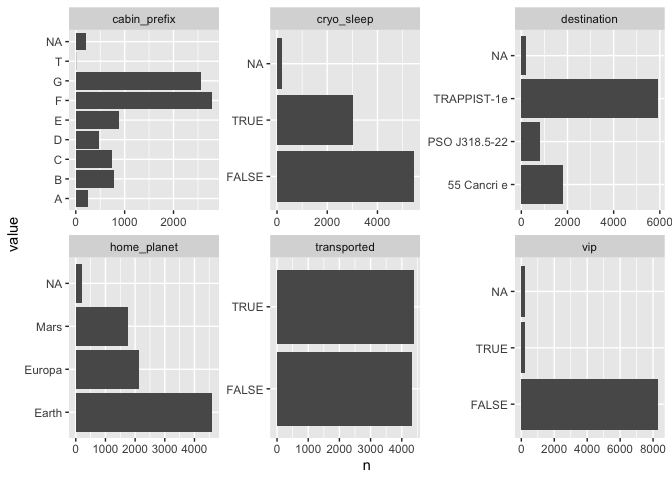
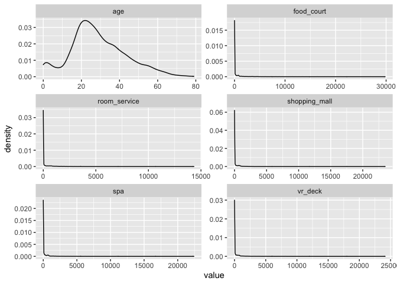
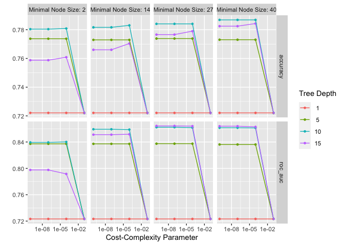

R Notebook
================

This is the first in a series of threads exploring tree-based machine
learning models in R. Decision trees underpin some powerful machine
learning algorithms like random forest or xgboost.

Decision trees come in two types. When the variable we want to predict
is categorical (yes/no; red/blue/yellow) we have a classification tree.
When the variable is continuous (income; litres of whisky) this is a
regression tree. This thread focuses on classification trees. 

Let’s look at a dummy example. We want to predict if survived is Yes or
No using the other features. The algorithm breaks the data into smaller
and smaller chunks creating a ‘tree’ in the process. A tree is a set of
if else statements which we use to make a prediction. 

Splits are always binary. If you have a feature with multiple categories
(orange/green/purple) these are grouped into 2 (orange/green, purple)
with each combination evaluated to select the best one.

How are the best splits chosen? Several criteria can be used. I don’t
want to get too maths-heavy here but essentially the best splits are
ones which create the most similar groups. More similar groups leads to
better predictions.

Now we have covered some theory let’s do a problem in R using the
tidymodels package. tidymodels isn’t really one package it is a
collection of packages in a similar way to the tidyverse.

<https://www.tidymodels.org>

The data we will use is from the Kaggle spaceship titanic challenge. We
want to predict which passengers were transported off the planet using
the other features.

<https://www.kaggle.com/competitions/spaceship-titanic>

Splitting your data for fitting machine learning models is a whole
different rabbit hole to go down. In the real world you would want to
split your data into a training and test split as a minimum. Luckily
this has already been done for us so we read it in.

``` r
library(glue)
library(readr)
library(dplyr, warn.conflicts = FALSE)
library(janitor, warn.conflicts = FALSE)
library(stringr)
library(ggplot2)

file_train <- glue::glue(
  "{here::here()}/notebooks/decision-trees_20220608/train.csv",
)

# We want to predict the transported variable using the others. 

train <- file_train |> 
  readr::read_csv(progress = FALSE, show_col_types = FALSE) |> 
  janitor::clean_names() |> 
  dplyr::relocate(transported)

print(train)
```

    ## # A tibble: 8,693 × 14
    ##    transported passenger_id home_planet cryo_sleep cabin destination   age vip  
    ##    <lgl>       <chr>        <chr>       <lgl>      <chr> <chr>       <dbl> <lgl>
    ##  1 FALSE       0001_01      Europa      FALSE      B/0/P TRAPPIST-1e    39 FALSE
    ##  2 TRUE        0002_01      Earth       FALSE      F/0/S TRAPPIST-1e    24 FALSE
    ##  3 FALSE       0003_01      Europa      FALSE      A/0/S TRAPPIST-1e    58 TRUE 
    ##  4 FALSE       0003_02      Europa      FALSE      A/0/S TRAPPIST-1e    33 FALSE
    ##  5 TRUE        0004_01      Earth       FALSE      F/1/S TRAPPIST-1e    16 FALSE
    ##  6 TRUE        0005_01      Earth       FALSE      F/0/P PSO J318.5…    44 FALSE
    ##  7 TRUE        0006_01      Earth       FALSE      F/2/S TRAPPIST-1e    26 FALSE
    ##  8 TRUE        0006_02      Earth       TRUE       G/0/S TRAPPIST-1e    28 FALSE
    ##  9 TRUE        0007_01      Earth       FALSE      F/3/S TRAPPIST-1e    35 FALSE
    ## 10 TRUE        0008_01      Europa      TRUE       B/1/P 55 Cancri e    14 FALSE
    ## # … with 8,683 more rows, and 6 more variables: room_service <dbl>,
    ## #   food_court <dbl>, shopping_mall <dbl>, spa <dbl>, vr_deck <dbl>, name <chr>

``` r
library(stringr)

summary(train)
```

    ##  transported     passenger_id       home_planet        cryo_sleep     
    ##  Mode :logical   Length:8693        Length:8693        Mode :logical  
    ##  FALSE:4315      Class :character   Class :character   FALSE:5439     
    ##  TRUE :4378      Mode  :character   Mode  :character   TRUE :3037     
    ##                                                        NA's :217      
    ##                                                                       
    ##                                                                       
    ##                                                                       
    ##     cabin           destination             age           vip         
    ##  Length:8693        Length:8693        Min.   : 0.00   Mode :logical  
    ##  Class :character   Class :character   1st Qu.:19.00   FALSE:8291     
    ##  Mode  :character   Mode  :character   Median :27.00   TRUE :199      
    ##                                        Mean   :28.83   NA's :203      
    ##                                        3rd Qu.:38.00                  
    ##                                        Max.   :79.00                  
    ##                                        NA's   :179                    
    ##   room_service       food_court      shopping_mall          spa         
    ##  Min.   :    0.0   Min.   :    0.0   Min.   :    0.0   Min.   :    0.0  
    ##  1st Qu.:    0.0   1st Qu.:    0.0   1st Qu.:    0.0   1st Qu.:    0.0  
    ##  Median :    0.0   Median :    0.0   Median :    0.0   Median :    0.0  
    ##  Mean   :  224.7   Mean   :  458.1   Mean   :  173.7   Mean   :  311.1  
    ##  3rd Qu.:   47.0   3rd Qu.:   76.0   3rd Qu.:   27.0   3rd Qu.:   59.0  
    ##  Max.   :14327.0   Max.   :29813.0   Max.   :23492.0   Max.   :22408.0  
    ##  NA's   :181       NA's   :183       NA's   :208       NA's   :183      
    ##     vr_deck            name          
    ##  Min.   :    0.0   Length:8693       
    ##  1st Qu.:    0.0   Class :character  
    ##  Median :    0.0   Mode  :character  
    ##  Mean   :  304.9                     
    ##  3rd Qu.:   46.0                     
    ##  Max.   :24133.0                     
    ##  NA's   :188

``` r
# First a bit of data prep and some simple feature engineering to create the 
# cabin_prefix variable.

train <- train |> 
  dplyr::mutate(cabin_prefix = stringr::str_sub(cabin, 1, 1)) |> 
  mutate(dplyr::across(where(~is.character(.)|is.logical(.)), as.factor)) |> 
  select(-name, -passenger_id, -cabin) 

# Some NAs but not in the target variable so all good for decision trees

summary(train)
```

    ##  transported  home_planet   cryo_sleep          destination        age       
    ##  FALSE:4315   Earth :4602   FALSE:5439   55 Cancri e  :1800   Min.   : 0.00  
    ##  TRUE :4378   Europa:2131   TRUE :3037   PSO J318.5-22: 796   1st Qu.:19.00  
    ##               Mars  :1759   NA's : 217   TRAPPIST-1e  :5915   Median :27.00  
    ##               NA's  : 201                NA's         : 182   Mean   :28.83  
    ##                                                               3rd Qu.:38.00  
    ##                                                               Max.   :79.00  
    ##                                                               NA's   :179    
    ##     vip        room_service       food_court      shopping_mall    
    ##  FALSE:8291   Min.   :    0.0   Min.   :    0.0   Min.   :    0.0  
    ##  TRUE : 199   1st Qu.:    0.0   1st Qu.:    0.0   1st Qu.:    0.0  
    ##  NA's : 203   Median :    0.0   Median :    0.0   Median :    0.0  
    ##               Mean   :  224.7   Mean   :  458.1   Mean   :  173.7  
    ##               3rd Qu.:   47.0   3rd Qu.:   76.0   3rd Qu.:   27.0  
    ##               Max.   :14327.0   Max.   :29813.0   Max.   :23492.0  
    ##               NA's   :181       NA's   :183       NA's   :208      
    ##       spa             vr_deck         cabin_prefix 
    ##  Min.   :    0.0   Min.   :    0.0   F      :2794  
    ##  1st Qu.:    0.0   1st Qu.:    0.0   G      :2559  
    ##  Median :    0.0   Median :    0.0   E      : 876  
    ##  Mean   :  311.1   Mean   :  304.9   B      : 779  
    ##  3rd Qu.:   59.0   3rd Qu.:   46.0   C      : 747  
    ##  Max.   :22408.0   Max.   :24133.0   (Other): 739  
    ##  NA's   :183       NA's   :188       NA's   : 199

Before we fit a model we need to do some data wrangling and exploring. I
have also done some simple feature engineering here by creating a
cabin_prefix variable. Hopefully it helps predictions.

``` r
library(ggplot2)
library(tidyr)

# barplots for the categorical variables

train |> 
  # too many unique in these cols to be useful in plot
  select(where(is.factor)) |> 
  tidyr::pivot_longer(everything(), names_to = "var_name") |> 
  dplyr::arrange(var_name, value) |> 
  dplyr::count(var_name, value) |> 
  ggplot2::ggplot(aes(value, n, group = var_name)) +
  ggplot2::geom_bar(stat = "identity") +
  ggplot2::coord_flip() +
  ggplot2::facet_wrap(var_name ~ ., scales = "free")
```

<!-- -->

``` r
ggsave(glue("{here::here()}/thread-figures/decision-trees_20220608/cat-vars.png"), 
       width = 7.65, height = 6.375, dpi = 550)
 
# line charts for the numeric variables

train |> 
  select(where(is.numeric)) |> 
  pivot_longer(everything(), names_to = "var_name") |> 
  ggplot(aes(value, group = var_name)) +
  ggplot2::geom_density() +
  facet_wrap(var_name ~ ., scales = "free", nrow = 3, ncol = 2)
```

    ## Warning: Removed 1122 rows containing non-finite values (stat_density).

<!-- -->

``` r
ggsave(glue("{here::here()}/thread-figures/decision-trees_20220608/num-vars.png"), 
       width = 7.65, height = 6.375, dpi = 550)
```

    ## Warning: Removed 1122 rows containing non-finite values (stat_density).

Next we split our data into folds, an important step to prevent
overfitting. It would be easy to create a model which fits our training
set too well but makes poor predictions on new data. K-Fold Cross
validation combats this problem. 5 folds are fairly typical.

``` r
library(tidymodels)
```

    ## ── Attaching packages ────────────────────────────────────── tidymodels 0.2.0 ──

    ## ✔ broom        0.8.0     ✔ rsample      0.1.1
    ## ✔ dials        0.1.1     ✔ tibble       3.1.7
    ## ✔ infer        1.0.0     ✔ tune         0.2.0
    ## ✔ modeldata    0.1.1     ✔ workflows    0.2.6
    ## ✔ parsnip      0.2.1     ✔ workflowsets 0.2.1
    ## ✔ purrr        0.3.4     ✔ yardstick    0.0.9
    ## ✔ recipes      0.2.0

    ## ── Conflicts ───────────────────────────────────────── tidymodels_conflicts() ──
    ## ✖ purrr::discard()  masks scales::discard()
    ## ✖ dplyr::filter()   masks stats::filter()
    ## ✖ recipes::fixed()  masks stringr::fixed()
    ## ✖ dplyr::lag()      masks stats::lag()
    ## ✖ yardstick::spec() masks readr::spec()
    ## ✖ recipes::step()   masks stats::step()
    ## • Dig deeper into tidy modeling with R at https://www.tmwr.org

``` r
set.seed(500)
train_folds <- rsample::vfold_cv(train, v = 5)
```

We then specify our model. Notice I have supplied tune() to the
decision_tree function arguments. This, combined with the parameters I
define from the grid_regular function ensures the best parameters for
our model are found.

``` r
model_spec <- parsnip::decision_tree(mode = "classification", 
                                     cost_complexity = tune::tune(),
                                     tree_depth = tune(),
                                     min_n = tune())

# In reality we might expand this out to try more combinations

model_paras <- dials::grid_regular(dials::cost_complexity(), 
                                   dials::tree_depth(), 
                                   dials::min_n(), 
                                   levels = 4)

print(model_paras)
```

    ## # A tibble: 64 × 3
    ##    cost_complexity tree_depth min_n
    ##              <dbl>      <int> <int>
    ##  1    0.0000000001          1     2
    ##  2    0.0000001             1     2
    ##  3    0.0001                1     2
    ##  4    0.1                   1     2
    ##  5    0.0000000001          5     2
    ##  6    0.0000001             5     2
    ##  7    0.0001                5     2
    ##  8    0.1                   5     2
    ##  9    0.0000000001         10     2
    ## 10    0.0000001            10     2
    ## # … with 54 more rows

Now we tune our model. Notice I have used the doParallel package here.
This means parameters will be tuned at the same time across your
computers cores and, even in this small example, it saves us time. This
is very powerful for larger datasets. 

``` r
library(doParallel)
```

    ## Loading required package: foreach

    ## 
    ## Attaching package: 'foreach'

    ## The following objects are masked from 'package:purrr':
    ## 
    ##     accumulate, when

    ## Loading required package: iterators

    ## Loading required package: parallel

``` r
doParallel::registerDoParallel()

set.seed(505)

models <- tune_grid(model_spec, transported ~ ., resamples = train_folds, 
                    grid = model_paras)
```

Now we see how our model performed and select the best parameter
combination. At this stage you might take a step back and try new
parameter combinations you suspect may improve things but we will skip
that here. 

``` r
print(tune::collect_metrics(models))
```

    ## # A tibble: 128 × 9
    ##    cost_complexity tree_depth min_n .metric  .estimator  mean     n std_err
    ##              <dbl>      <int> <int> <chr>    <chr>      <dbl> <int>   <dbl>
    ##  1    0.0000000001          1     2 accuracy binary     0.722     5 0.00521
    ##  2    0.0000000001          1     2 roc_auc  binary     0.723     5 0.00603
    ##  3    0.0000001             1     2 accuracy binary     0.722     5 0.00521
    ##  4    0.0000001             1     2 roc_auc  binary     0.723     5 0.00603
    ##  5    0.0001                1     2 accuracy binary     0.722     5 0.00521
    ##  6    0.0001                1     2 roc_auc  binary     0.723     5 0.00603
    ##  7    0.1                   1     2 accuracy binary     0.722     5 0.00521
    ##  8    0.1                   1     2 roc_auc  binary     0.723     5 0.00603
    ##  9    0.0000000001          5     2 accuracy binary     0.774     5 0.00602
    ## 10    0.0000000001          5     2 roc_auc  binary     0.837     5 0.00453
    ## # … with 118 more rows, and 1 more variable: .config <chr>

``` r
ggplot2::autoplot(models)
```

<!-- -->

``` r
ggsave(glue("{here::here()}/thread-figures/decision-trees_20220608/metrics.png"), 
       width = 7.65, height = 6.375, dpi = 550)

print(tune::show_best(models, "accuracy"))
```

    ## # A tibble: 5 × 9
    ##   cost_complexity tree_depth min_n .metric  .estimator  mean     n std_err
    ##             <dbl>      <int> <int> <chr>    <chr>      <dbl> <int>   <dbl>
    ## 1    0.0000000001         10    40 accuracy binary     0.787     5 0.00492
    ## 2    0.0000001            10    40 accuracy binary     0.787     5 0.00492
    ## 3    0.0001               10    40 accuracy binary     0.787     5 0.00492
    ## 4    0.0001               15    40 accuracy binary     0.784     5 0.00394
    ## 5    0.0000000001         10    27 accuracy binary     0.784     5 0.00507
    ## # … with 1 more variable: .config <chr>

``` r
final_model <- models |> 
  tune::select_best("accuracy") |> 
  tune::finalize_model(model_spec, parameters = _)

print(final_model)
```

    ## Decision Tree Model Specification (classification)
    ## 
    ## Main Arguments:
    ##   cost_complexity = 1e-10
    ##   tree_depth = 10
    ##   min_n = 40
    ## 
    ## Computational engine: rpart

``` r
library(vip)
```

    ## 
    ## Attaching package: 'vip'

    ## The following object is masked from 'package:utils':
    ## 
    ##     vi

``` r
model_fit <- fit(final_model, transported ~ ., train)

png(glue("{here::here()}/thread-figures/decision-trees_20220608/importance.png"),
    units = "in", width = 7.65, height = 6.375, res = 550 )

vip::vip(model_fit, geom = "col") 

dev.off()
```

    ## quartz_off_screen 
    ##                 2

We now predict the test set. This is a kaggle challenge so we don’t have
labels for the test set. But to get our score we can submit our results
to Kaggle as a csv file. We obtain an accuracy of 78% - not bad and
similar to our training performance.

``` r
file_test <- glue("{here::here()}/notebooks/decision-trees_20220608/test.csv")

# We want to predict the transported variable using the others. 

test <- file_test |> 
  read_csv(progress = FALSE, show_col_types = FALSE) |> 
  clean_names() |> 
  mutate(cabin_prefix = str_sub(cabin, 1, 1)) |>
  mutate(across(where(~is.character(.)|is.logical(.)), as.factor)) |> 
  select(-name, -cabin) 
  
predicted <- tibble(PassengerId = test$passenger_id, 
                    Transported = predict(model_fit, test)) |> 
  mutate(Transported = unlist(Transported),
         Transported = stringr::str_to_sentence(Transported))

print(predicted)
```

    ## # A tibble: 4,277 × 2
    ##    PassengerId Transported
    ##    <fct>       <chr>      
    ##  1 0013_01     True       
    ##  2 0018_01     False      
    ##  3 0019_01     True       
    ##  4 0021_01     True       
    ##  5 0023_01     True       
    ##  6 0027_01     False      
    ##  7 0029_01     True       
    ##  8 0032_01     True       
    ##  9 0032_02     True       
    ## 10 0033_01     True       
    ## # … with 4,267 more rows

``` r
file_predicted <- glue(
  "{here::here()}/notebooks/decision-trees_20220608/predicted.csv"
)

readr::write_csv(predicted, file = file_predicted)
```
