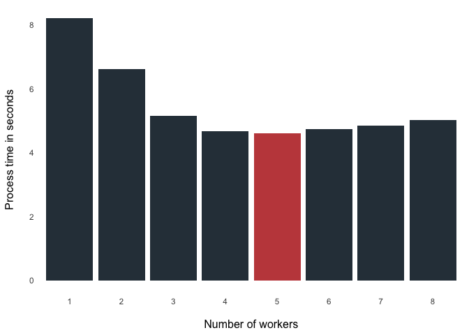

furrr
================

### Setup

``` r
library(dplyr)
library(ggplot2)
library(purrr)
library(furrr)
library(here)
```

### Example using purrr::map

``` r
# Create dummy data

num_elements <- 10000
matrices <- map(1:num_elements, ~matrix(runif(10000), ncol = 5))

# Run with purrr::map and time it

start_time <- Sys.time()

row_sums <- map(matrices, rowSums)

process_time_purrr <- as.numeric(Sys.time() - start_time)

print(process_time_purrr)
```

    [1] 8.208931

### Example using furrr::future_map

``` r
remove(row_sums) # remove from memory, fairer test

start_time <- Sys.time()

plan("multisession", workers = 2)
row_sums <- future_map(matrices, rowSums)

process_time_furrr <- as.numeric(Sys.time() - start_time)

print(process_time_furrr)
```

    [1] 6.623353

### How many workers is optimal?

``` r
# Store times

process_times <- vector("numeric", 8)
process_times[1] <- process_time_purrr
process_times[2] <- process_time_furrr

# Try 3 to 8 workers

for (i in 3:8) {
  
  remove(row_sums)

  start_time <- Sys.time()

  plan("multisession", workers = i)
  row_sums <- future_map(matrices, rowSums)

  process_times[i] <- as.numeric(Sys.time() - start_time)

}

print(min(process_times))
```

    [1] 4.614438

``` r
print(min(process_times) / process_times[1])
```

    [1] 0.5621241

### Plot it

``` r
# Plot it

times <- tibble(workers = as.character(1:8), process_time = process_times) |> 
  mutate(fastest = case_when(process_time == min(process_time) ~ "yes",
                             TRUE ~ "no"))

chart_colours <- c("yes" = "#C34A4A", "no" = "#2E3D47")

times |> 
  ggplot(aes(x = workers, y = process_time, fill = fastest)) +
  geom_bar(stat = "identity") +
  labs(x = "Number of workers", y = "Process time in seconds") +
  theme_minimal() +
  scale_fill_manual(values = chart_colours) + 
  theme(legend.position = "none",
        panel.grid.major = element_blank(),
        panel.grid.minor = element_blank(),
        axis.title.x = element_text(size = 12, margin = margin(15, 0, 0, 0)),
        axis.title.y = element_text(size = 12, margin = margin(0, 15, 0, 0)))
```



``` r
file <- paste0(here::here(), "/notebooks/furrr/times.png")
ggsave(file, width = 7.65, height = 6.375, dpi = 550 )
```
